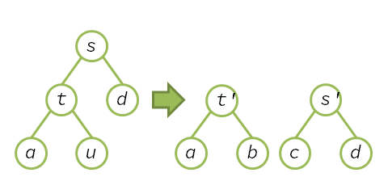

$$
A(s) = T(s) + \Phi(t') + \Phi(s') + \Phi(s)
$$
For $T(s) = 1 + T(u)$,
$$
= 1 + T(u) + \Phi(t') + \Phi(s') + \Phi(s)
$$
$$
= 1 + A(u) - \Phi(b) - \Phi(c) - \Phi(u) + \Phi(t') + \Phi(s') + \Phi(s)
$$
$$
= 1 + A(u) - \Phi(b) - \Phi(c) - \Phi(u) + (\phi(t') + \Phi(a) + \Phi(b)) + (\phi(s') + \Phi(c) + \Phi(d)) + (\phi(s) + \phi(t) + \Phi(u) + \Phi(a) + \Phi(d))
$$
$$
= 1 + A(u) + \phi(s') + \phi(t') - \phi(s) - \phi(t)
$$
$$
\leq 2 + 2\phi(u) + \phi(s') + \phi(t') - \phi(s) - \phi(t)
$$
For $\phi(u) < \phi(s), \phi(u) < \phi(t)$,
$$
< 2 + \phi(s') + \phi(t')
$$
For $\#s' + \#t' = \#s$ and Lemma 5,
$$
< 1 + 2\phi(s)
$$
