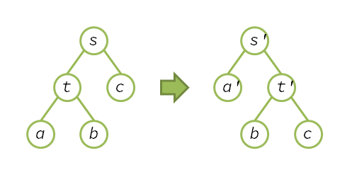

$$
A(s) = T(s) + \Phi(s') - \Phi(s)
$$
For $T(s) = 1 + T(u)$,
$$
= 1 + T(a) + \Phi(s') - \Phi(s)
$$
$$
= 1 + A(a) - \Phi(a') + \Phi(a) + \Phi(s') - \Phi(s)
$$
$$
= 1 + A(a) - \Phi(a') + \Phi(a) + (\phi(s') + \phi(t') + \Phi(a') + \Phi(b) + \Phi(c)) - (\phi(s) + \phi(t) + \Phi(a) + \Phi(b) + \Phi(c))
$$
$$
= 1 + A(a) + \phi(s') + \phi(t') - \phi(s) - \phi(t)
$$
$$
\leq 2 + 2\phi(a) + \phi(s') + \phi(t') - \phi(s) - \phi(t)
$$
For $\phi(a) < \phi(t), \phi(s') < \phi(s)$,
$$
< 2 + \phi(a) + \phi(t')
$$
For $\#a + \#t' = \#s$ and Lemma 5.1,
$$
< 1 + 2\phi(s)
$$
